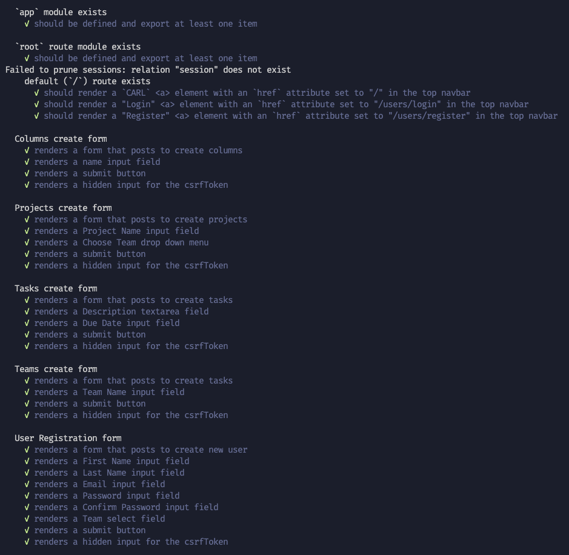
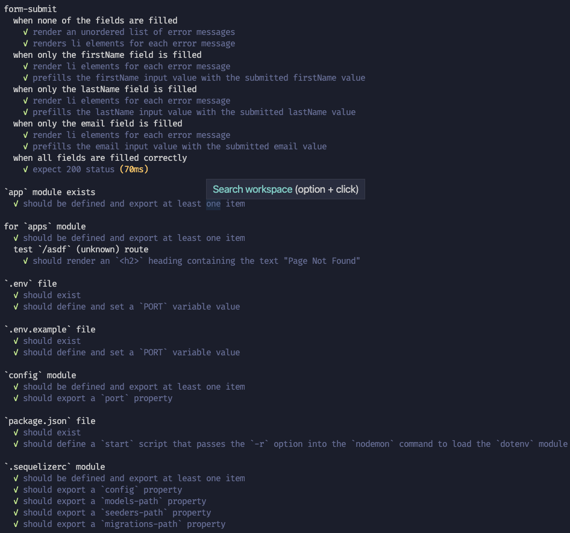
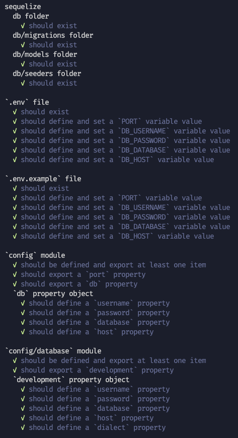

# Introduction
CARL is a work-flow application to help users organize their tasks.  
Tasks can be assigned to specific projects where they can be organized into categories.

- User **must** belong to a Team in order to be able to create projects and assign tasks

# Live Link

[C.A.R.L Work-flow Manager](https://still-reef-05529.herokuapp.com/)

# Technologies

- Database management
	- Sequelize ORM
	- Postgres
- Front-end development
	- React
	- AJAX
	- DOM manipulation
	- CSS
	- Bootstrap
- Back-end development
	- Express.js
	- Express-session
	- Connect PG Simple
	- Csurf
	- Dotenv
	- Sequelize
	- Bcrypt
	- Unit tests to test:
		- Mocha
		- Chai
		- Cheerio
		- Moment
		- Sqlite3
		- Supertest
		- Umzug

# Features

- Professional landing page


- Drag-n-drop using React
```javascript
code snippet using react
and maybe gif
```

- Create and manage projects


- Create and manage tasks


- Unit tests
	- Models exists and creates good instances
	- Cannot create instance with null values
	- Able to query the data using sequelize
	- Can successfully eager load data from associated table
	- Correctly set:
		- environment variables
		- sequelizerc configs
	-  Correctly renders:
		- homepage
		- form elements with correct fields






# Technical Challenges

### Front-end
- React Components
  - utilized React Beautiful DnD to create fluid, intuitive interactions with task cards in the browser
  - used node-fetch to persist data and positioning of tasks/columns to the database on dragEnd events
  - created several custom class-based React components for adding tasks/columns
```jsx
class Column extends React.Component {
  render() {
    return (
      <Draggable draggableId={this.props.column.id} index={this.props.index}>
        {(provided) => (

          <ColumnContainer {...provided.draggableProps} ref={provided.innerRef}>


            <ColHeader>
              <Title {...provided.dragHandleProps}>{this.props.column.title}</Title>
                <ColumnOperation>
                  <form method='post' action={`${window.location.pathname}/${parseInt(this.props.column.id.match(/\d+/)[0], 10)}/delete`}>
                      <TaskDeleteBtn type='submit'><TaskOperation className='fa fa-trash'></TaskOperation></TaskDeleteBtn>
                  </form>
                  <a href={`${window.location.pathname}/${parseInt(this.props.column.id.match(/\d+/)[0], 10)}/edit`}>
                      <TaskOperation className="fa fa-pencil-square-o"></TaskOperation>
                  </a>
                </ColumnOperation>
            </ColHeader>


            <TaskAdd className="fa fa-plus" href={`${window.location.pathname}/${parseInt(this.props.column.id.match(/\d+/)[0], 10)}/tasks/create`}></TaskAdd>

            <Droppable type='task' droppableId={this.props.column.id}>
              {(provided, snapshot) => (

                <TaskList ref={provided.innerRef} {...provided.droppableProps} isDraggingOver={snapshot.isDraggingOver}>

                  {this.props.tasks.map((task, index) => (
                    <Task key={task.id} columnId={parseInt(this.props.column.id.match(/\d+/)[0], 10)} task={task} index={index} />
                  ))}


                  {provided.placeholder}
                </TaskList>
              )}
            </Droppable>

          </ColumnContainer>

        )}
      </Draggable>
    )
  }
}
```
### Back-end
- Sequelize
  - implemented custom models for users, teams, projects, and tasks
  - utilized Sequelize hooks to encrpyt and hash registration passwords using the bcryptjs package
  - used custom data validation to confirm data input
- Authorization/Authentication
  - implemented express-session to track and persist end-user login state
- Express
  - used Express to handle Restful API endpoints
  - created custom middleware to manage security on website
  - added routes to handle CRUD operations for users, tasks, teams, projects, and columns
- Unit Tests
	- decided to use customized functions to create model instances instead of using separate seed file for test environment

```javascript
async  function  testCreate(callback)  {
	let succeeded =  true;
	try  {
		await  callback();
	}  catch (e) {
		succeeded =  false;
	}
	return succeeded;
}

async  function  createModel(Model,  object)  {
	let instance =  null;
	await  testCreate(async  ()  =>  {
		instance =  await Model.create(object);
	});
	return instance;
}

const  passwordSample  =  'Abc1!'
function  userValues(o)  {
	return  {
		firstName:  str(20),
		lastName:  str(20),
		hashedPassword: passwordSample,
		email:  email(200),
		teamId:  Math.floor(Math.random() *  2),
		...o
	};
}
```
```javascript
it('exists and creates a good instance',  async  ()  =>  {
	const  {  models,  error  }  =  loadModel('User');
	if (stopTest(errorMessage || userError || error)) return;	
	const  {  User  }  = models;
	const  values  =  userValues({ teamId });
	succeeded =  await  createModel(User, values);
	if (!succeeded) return expect.fail(`Could not create an User with ${j(values)}`);
});
```


# Future Implementation

- Delete user
- Allow users to have many teams
- Allow a user to remove team members
- Update unit tests so that it can log in to pass the test statements
- Add Modals to edit tasks and create tasks
- Allow users to create teams
- Allow users to delete teams
- Allow users to invite other users to team


